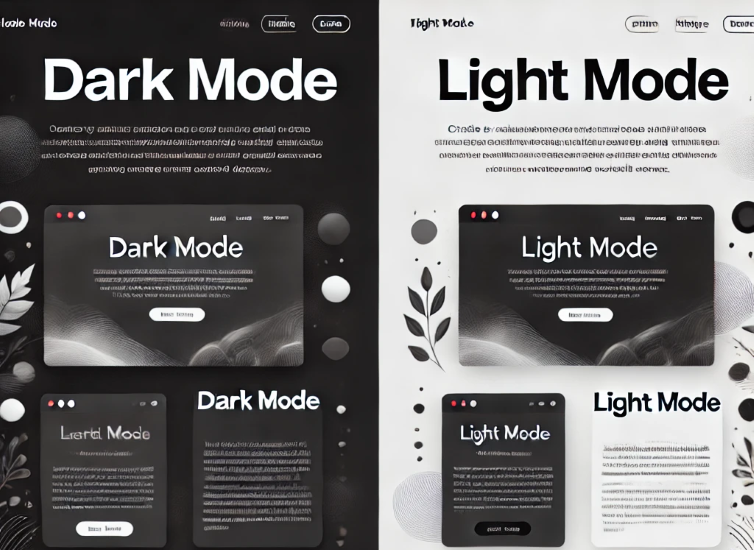
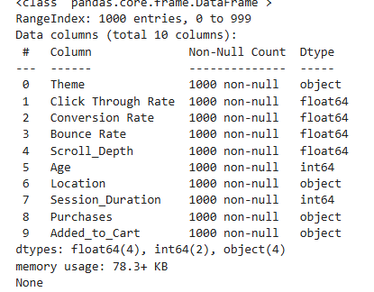
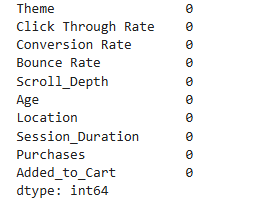

# A-B-Testing-of-Themes-using-Python


Have you ever wondered how websites and apps decide on the best design, layout, or theme? Instead of guessing what works best, many platforms use **A/B testing** to experiment with different design variations and see what users respond to the most.

By testing these variations with real users and analyzing the data, businesses can figure out which design elements improve user engagement, clicks, or sales. This data-driven approach helps them make informed decisions rather than relying on guesswork.

If you're curious about how to run an **A/B test** to find the best theme  , you're in the right place. In this article, I'll walk you through the entire process of performing **A/B testing of themes using Python** — step by step. Let's dive in! 🚀

## A/B Testing of Themes: Overview

A/B testing is a popular technique in data science that helps businesses compare different designs, marketing strategies, or themes to see which one works best. Instead of relying on guesswork, A/B testing allows you to make decisions based on real data — leading to better user experiences, improved performance, and smarter business outcomes.

Imagine a company trying to decide between two website themes: **Dark Mode** and **Light Mode**. By running an A/B test, they can see which theme users prefer and which one performs better. This way, they can confidently choose the design that keeps visitors engaged and satisfied.




For the task of **A/B testing of themes**, we need a dataset containing user interaction data for two different themes or design templates.  

I found an ideal dataset for this task. You can download the dataset from [here](website_ab_test.csv).

Let’s get started with the task of A/B testing of themes by importing the necessary Python libraries

```python
import pandas as pd
import numpy as np  
import matplotlib.pyplot as plt 
import plotly.express as px
import plotly.graph_objects as go
import seaborn as sns
from statsmodels.stats.proportion import proportions_ztest
from scipy import stats
import warnings
warnings.filterwarnings('ignore')

colors = px.colors.qualitative.Plotly
data = pd.read_csv('website_ab_test.csv')

```


Check the information about the data
```python
print(data.info())
```


Check the Missing values
```python
print(data.isnull().sum())

```

