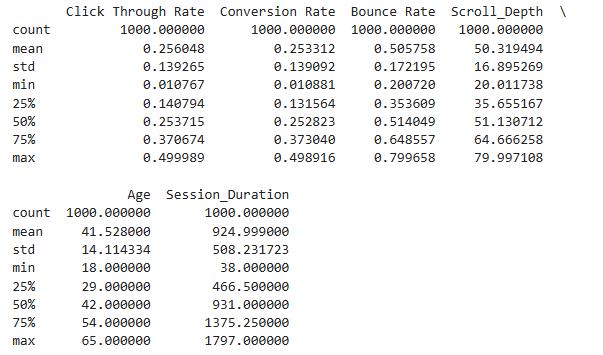
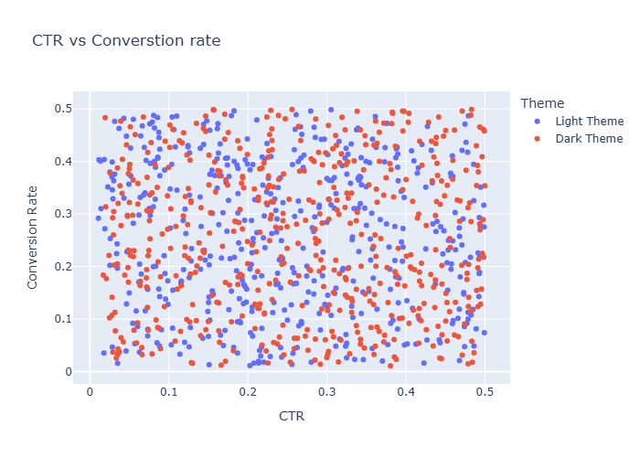

# A-B-Testing-of-Themes-using-Python


Have you ever wondered how websites and apps decide on the best design, layout, or theme? Instead of guessing what works best, many platforms use **A/B testing** to experiment with different design variations and see what users respond to the most.

By testing these variations with real users and analyzing the data, businesses can figure out which design elements improve user engagement, clicks, or sales. This data-driven approach helps them make informed decisions rather than relying on guesswork.

If you're curious about how to run an **A/B test** to find the best theme  , you're in the right place. In this article, I'll walk you through the entire process of performing **A/B testing of themes using Python** — step by step. Let's dive in! 🚀

## A/B Testing of Themes: Overview

A/B testing is a popular technique in data science that helps businesses compare different designs, marketing strategies, or themes to see which one works best. Instead of relying on guesswork, A/B testing allows you to make decisions based on real data — leading to better user experiences, improved performance, and smarter business outcomes.

Imagine a company trying to decide between two website themes: **Dark Mode** and **Light Mode**. By running an A/B test, they can see which theme users prefer and which one performs better. This way, they can confidently choose the design that keeps visitors engaged and satisfied.


For the task of **A/B testing of themes**, we need a dataset containing user interaction data for two different themes or design templates.  

I found an ideal dataset for this task. You can download the dataset from [here](website_ab_test.csv).

Let’s get started with the task of A/B testing of themes by importing the necessary Python libraries

```python
import pandas as pd
import numpy as np  
import matplotlib.pyplot as plt 
import plotly.express as px
import plotly.graph_objects as go
import seaborn as sns
from statsmodels.stats.proportion import proportions_ztest
from scipy import stats
import warnings
warnings.filterwarnings('ignore')

colors = px.colors.qualitative.Plotly
data = pd.read_csv('website_ab_test.csv')

```


Check the information about the data
```python
print(data.info())
```


Check the Missing values
```python
print(data.isnull().sum())

```


Discriptive statistics of the data
```python
print(data.describe())

```


Relationship between CTR and conversation rate of both themes
```python
fig=go.Figure()
for theme in data['Theme'].unique():
    theme_data=data[data['Theme']==theme]
    fig.add_trace(go.Scatter(x=theme_data['Click Through Rate'], y=theme_data['Conversion Rate'], mode='markers', name=theme))
fig.update_layout(title='CTR vs Converstion rate', xaxis_title='CTR', yaxis_title='Conversion Rate', showlegend=True, legend_title='Theme',width=700, height=500)
fig.show()

```


Histogram of CTR for both themes
```python
fig=go.Figure()
for i,theme in enumerate(data['Theme'].unique()):
    theme_data=data[data['Theme']==theme]
    fig.add_trace(go.Histogram(x=theme_data['Click Through Rate'], name=theme, histnorm='percent', marker_color=colors[i  % len(colors)], opacity=0.6,nbinsx=20))
fig.update_layout(title='Click Through Rate By Theme', xaxis_title='CTR', yaxis_title='Frequency', showlegend=True, legend_title='Theme',width=700, height=500)
fig.show()

```


Distribution of the bounce rates for both themes
```python
fig=go.Figure()
for i,theme in enumerate(data['Theme'].unique()):
    theme_data=data[data['Theme']==theme]
    fig.add_trace(go.Box(y=theme_data['Bounce Rate'], name=theme, marker_color=colors[i  % len(colors)]))
fig.update_layout(title='Bounce Rate By Theme', yaxis_title='Bounce Rate', showlegend=True, legend_title='Theme',width=700, height=500)
fig.show()

```


Distribution of the Scroll Depth for both themes
```python
fig=go.Figure()
for i,theme in enumerate(data['Theme'].unique()):
    theme_data=data[data['Theme']==theme]
    
    fig.add_trace(go.Box(y=theme_data['Scroll_Depth'], name=theme, marker_color=colors[i  % len(colors)]))
fig.update_layout(title='Scroll Depth By Theme', yaxis_title='Scroll Depth', showlegend=True, legend_title='Theme',width=700, height=500)
fig.show()
```


## Comparison of both themes based on purchases hypothesis testing
#### Null Hypothesis: There is a no statstical significant difference in the proportion of purchases between the two themes
#### Alternative Hypothesis: There is  significant difference in the proportion of purchases between the two themes
#### Significance Level: 0.05
#### Perform the two sample proportion z-test to compare the proportion of purchases between the two themes

```python
light_theme_data=data[data['Theme']=='Light Theme']
dark_theme_data=data[data['Theme']=='Dark Theme']
light_theme_data_Purchases =light_theme_data[light_theme_data['Purchases']=='Yes'].shape[0]
dark_theme_data_Purchases =dark_theme_data[dark_theme_data['Purchases']=='Yes'].shape[0]
light_theme_data_total =light_theme_data.shape[0]
dark_theme_data_total =dark_theme_data.shape[0]
# Perform the two sample proportion z-test
z_stat, p_val = proportions_ztest([light_theme_data_Purchases, dark_theme_data_Purchases], [light_theme_data_total, dark_theme_data_total])
light_theme_data_conversion_rate = light_theme_data_Purchases/light_theme_data_total
dark_theme_data_conversion_rate = dark_theme_data_Purchases/dark_theme_data_total
print('Light Theme Conversion Rate:', light_theme_data_conversion_rate)
print('Dark Theme Conversion Rate:', dark_theme_data_conversion_rate)
print("A/B Testing - z-statistic:", z_stat, " p-value:", p_val)

```
### Conclusion
Z-statistic: 0.853 p-value: 0.393
z-statistic measures the number of standard deviations between the two proportions.in this case the z-statistic is positive,which means that the conversion rate of the light theme is slightly higher than the dark theme.
p-value represents he probability of observing the observed difference in conversion rates or a more extreme difference if the null hypothesis is true. 
Since the p-value is greater than the significance level, we do not have enough evidence to reject the null hypothesis therefore the observed difference in conversion rates is not statistically significant.
Therefore, we can conclude that there is no significant difference in the proportion of purchases between the two themes.

## Comparison of both themes based on session duration hypothesis testing
#### Null Hypothesis: There is a no statstical significant difference in the average session duration between the two themes
#### Alternative Hypothesis: There is  significant difference in the average session duration between the two themes   
#### Significance Level: 0.05
#### Perform the two sample t-test to compare the average session duration between the two themes

```python
light_theme_data_session_duration = light_theme_data['Session Duration']
dark_theme_data_session_duration = dark_theme_data['Session Duration']
# calculate the average session duration for both themes
light_theme_data_avg_session_duration = light_theme_data_session_duration.mean()
dark_theme_data_avg_session_duration = dark_theme_data_session_duration.mean()
# Perform the two sample t-test
t_stat, p_val = stats.ttest_ind(light_theme_data_session_duration, dark_theme_data_session_duration)   
print('Light Theme Average Session Duration:', light_theme_data_avg_session_duration)
print('Dark Theme Average Session Duration:', dark_theme_data_avg_session_duration)
print("A/B Testing - t-statistic:", t_stat, " p-value:", p_val)
```
### Conclusion
t-statistic: 0.853 p-value: 0.393'
The t-statistic measures the difference in the average session duration between the two themes, considering the variability within the datasets. 
In this case, the t-statistic is approximately 0.3528. 
A positive t-statistic value indicates that the average session duration of the Light Theme is slightly higher than the average session duration of the Dark Theme. 
The p-value represents the probability of observing the observed difference in average session duration or a more extreme difference if the null hypothesis is true.'
Since the p-value is greater than the significance level, we do not have enough evidence to reject the null hypothesis.'
Therefore, we can conclude that there is no significant difference in the average session duration between the two themes.'

##Summary
In this project, we analyzed the results of an A/B test conducted on a website to determine the optimal theme for conversion optimization.
We performed exploratory data analysis to understand the distribution of key metrics such as Click Through Rate (CTR), Conversion Rate, Bounce Rate, and Scroll Depth for both themes.
We visualized the relationships between these metrics and compared the performance of the Light Theme and Dark Theme.
